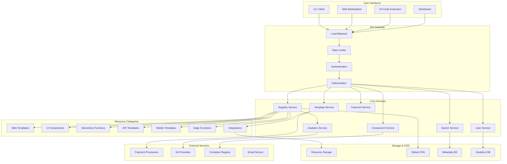
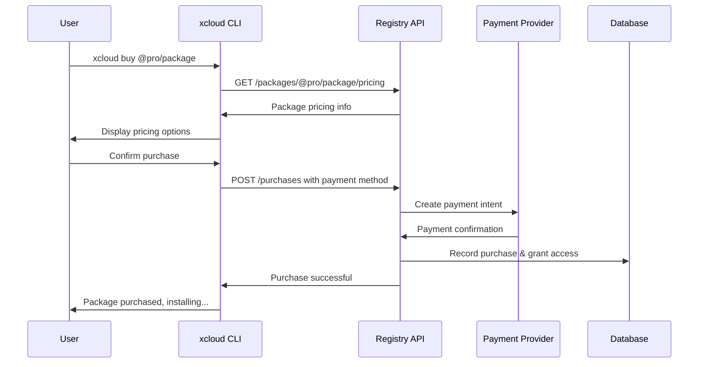

# xCloud Components & Templates Architecture 📦

> **PROPRIETARY PLATFORM**  
> This document describes the xCloud Components & Templates system,  
> a comprehensive marketplace for web development resources including  
> templates, components, serverless functions, and integrations.  
> This system is proprietary and available only through official xCloud channels.

## 📚 Table of Contents

1. [Overview](#-overview)
2. [System Architecture](#️-system-architecture)
3. [Component Categories](#-package-categories)
4. [Free vs Paid Resources](#-free-vs-paid-packages)
5. [Registry Infrastructure](#-registry-infrastructure)
6. [Authentication & Authorization](#-authentication--authorization)
7. [Payment System](#-payment-system)
8. [CLI Integration](#-cli-integration)
9. [Marketplace Frontend](#-marketplace-frontend)
10. [Developer Experience](#-developer-experience)
11. [API Specification](#-api-specification)
12. [Deployment Architecture](#-deployment-architecture)

## 🎯 Overview

**xcloud-components** is a comprehensive marketplace ecosystem for the xCloud
Platform, similar to npm but specialized for web development templates, UI
components, serverless functions, APIs, and integrations. It provides a
marketplace where developers can publish, discover, and monetize development
resources.

> **MODERN DEVELOPMENT PLATFORM**  
> The xCloud Components registry is a modern, cloud-native platform  
> designed for the future of web development. Unlike traditional package managers,  
> our system focuses on complete, deployable resources that work seamlessly  
> with the xCloud deployment infrastructure.

### Key Features

- 📦 **Multiple Resource Types**: Templates, components, functions, APIs, integrations
- 💰 **Monetization**: Free, paid, subscription, and enterprise tiers
- 🔐 **Secure Authentication**: API keys, OAuth, team management
- 🌐 **Global CDN**: Fast resource distribution worldwide
- 📊 **Analytics**: Usage metrics, performance tracking, revenue insights
- ⭐ **Community Features**: Reviews, ratings, discussions, showcases
- 🔧 **Developer Tools**: CLI, API, SDK, VS Code extension

## 🏗️ System Architecture

### High-Level Overview



## 📋 Package Categories

### 1. 🌐 Web Templates

Complete web application templates ready to deploy.

**Examples:**

- `@xcloud/react-dashboard` - Admin dashboard with charts and tables
- `@community/nextjs-blog` - SEO-friendly blog template
- `@pro/saas-boilerplate` - Full-featured SaaS starter kit (Paid)

### 2. 🎨 UI Components

Reusable frontend components for various frameworks.

**Examples:**

- `@xcloud/tailwind-ui-kit` - Collection of Tailwind CSS components
- `@community/react-charts` - Interactive charts for React
- `@pro/vue-datagrid` - Advanced data grid for Vue.js (Paid)

### 3. ⚡ Serverless Functions

Backend logic snippets that can be deployed instantly.

**Examples:**

- `@xcloud/image-resizer` - On-the-fly image resizing
- `@community/form-handler` - Email submission for static sites
- `@pro/stripe-payment` - Secure payment processing function (Paid)

### 4. 🔌 Integrations

Connectors for third-party services and APIs.

**Examples:**

- `@xcloud/supabase-auth` - Supabase authentication helper
- `@community/sendgrid-mailer` - Send emails via SendGrid
- `@enterprise/salesforce-sync` - Salesforce data synchronization (Enterprise)

### 5. 🗃️ Database Connectors

Plugins for easy database integration.

**Examples:**

- `@community/planetscale-driver` - PlanetScale serverless driver
- `@pro/mongodb-atlas-connector` - Optimized connector for MongoDB Atlas (Paid)

### 6. 🤖 AI/ML Models

Pre-trained models and AI services for applications.

**Examples:**

- `@xcloud/basic-chatbot` - Simple chatbot function
- `@pro/sentiment-analyzer` - Market sentiment analysis API (Paid)
- `@enterprise/custom-vision-model` - Professional computer vision models (Enterprise)

## 💰 Free vs Paid Packages

### Package Tiers

#### 🆓 Free Tier

- **Cost**: Free
- **Features**: Basic functionality, community support
- **Limits**: Rate limiting, basic features only
- **Examples**: Basic UI components, simple functions

#### 💎 Pro Tier

- **Cost**: $9.99 - $99.99 one-time or $4.99 - $19.99/month
- **Features**: Advanced functionality, priority support
- **Limits**: Higher rate limits, premium features
- **Examples**: Advanced templates, professional components

#### 🏢 Enterprise Tier

- **Cost**: $99.99 - $999.99/month
- **Features**: Full functionality, dedicated support, SLA
- **Limits**: No limits, white-label options
- **Examples**: Institutional-grade integrations, custom solutions

#### 🌟 Community Tier

- **Cost**: Pay-what-you-want or donations
- **Features**: Community-driven packages
- **Limits**: Varies by package
- **Examples**: Open-source contributions, experimental tools

### Monetization Models

1. **One-time Purchase**: Buy once, use forever
2. **Subscription**: Monthly/yearly recurring payments
3. **Usage-based**: Pay per API call or function execution
4. **Freemium**: Basic free, premium paid features
5. **Enterprise Licensing**: Custom enterprise contracts

## 🔐 Authentication & Authorization

### User Authentication

```bash
# CLI Authentication
xcloud auth login --username user@example.com
xcloud auth logout
xcloud auth whoami
xcloud auth token --create --name "CI/CD Token"
```

### Permission Levels

- **Public**: Read-only access to public packages
- **User**: Install free packages, purchase paid packages
- **Publisher**: Publish packages, manage own packages
- **Maintainer**: Manage organization packages
- **Admin**: Full system access

### API Keys

```bash
# Generate API key for programmatic access
xcloud auth apikey --create --scope "packages:read,packages:install"

# Use API key
export XCLOUD_API_KEY="xcp_1234567890abcdef"
xcloud install @pro/vue-datagrid
```

## 💳 Payment System

### Payment Flow



### Payment Methods

- **Credit/Debit Cards** (via Stripe)
- **PayPal**
- **Bank Transfers** (Enterprise)
- **Credits/Wallet** (Prepaid system)

## 💻 CLI Integration

### Enhanced CLI Commands

```bash
# Authentication
xcloud auth login
xcloud auth register
xcloud auth logout

# Package Management
xcloud search "react dashboard"
xcloud info @pro/saas-boilerplate
xcloud install @pro/saas-boilerplate
xcloud buy @pro/saas-boilerplate --tier monthly
xcloud uninstall @pro/saas-boilerplate

# Publishing
xcloud publish --category template --tier pro --price 29.99
xcloud unpublish @myorg/my-template
xcloud update-package --version 1.2.0

# Account Management
xcloud account info
xcloud purchases list
xcloud subscriptions manage
xcloud wallet balance
```

### Package Configuration

```json
```json
// xcloud-package.json
{
  "name": "@myorg/awesome-dashboard",
  "version": "1.0.0",
  "category": "template",
  "description": "An awesome dashboard template",
  "tier": "pro",
  "pricing": {
    "model": "subscription",
    "monthly": 19.99,
    "yearly": 199.99
  },
  "main": "src/index.js",
  "dependencies": {
    "@xcloud/tailwind-ui-kit": "^1.0.0",
    "@pro/react-charts": "^2.1.0"
  },
  "permissions": [
    "api.read",
    "database.write",
    "notifications.send"
  ],
  "keywords": [
    "react",
    "dashboard",
    "template",
    "admin"
  ],
  "author": {
    "name": "John Doe",
    "email": "john@example.com"
  },
  "license": "Commercial",
  "repository": "https://github.com/myorg/awesome-dashboard",
  "homepage": "https://packages.xcloud.io/@myorg/awesome-dashboard"
}
```

## 🌐 Marketplace Frontend

### Web Interface Features

- **Package Discovery**: Search, filter, sort packages
- **Detailed Package Pages**: Documentation, reviews, screenshots
- **User Profiles**: Developer profiles, published packages
- **Purchase Flow**: Secure checkout, license management
- **Dashboard**: Usage analytics, revenue tracking
- **Community Features**: Reviews, ratings, discussions

### Package Page Example

```
```bash
┌─────────────────────────────────────────────────────┐
│ @pro/saas-boilerplate                      ★ 4.9/5 │
│ Professional Next.js SaaS Boilerplate               │
│                                                     │
│ 💰 $49.99/month  🔥 2,138 downloads  📅 Updated 1d │
│                                                     │
│ Categories: [Template] [SaaS] [Next.js]             │
│                                                     │
│ [🛒 Buy Now] [📖 Documentation] [⭐ Reviews]       │
│                                                     │
│ Description:                                        │
│ A complete SaaS boilerplate with authentication,    │
│ payments, database, and more, built with Next.js... │
│                                                     │
│ Features:                                           │
│ ✅ Authentication (NextAuth.js)                     │
│ ✅ Payments (Stripe)                                │
│ ✅ Database (Prisma)                                │
│ ✅ UI Components (Tailwind CSS)                     │
│                                                     │
│ Requirements:                                       │
└─────────────────────────────────────────────────────┘
```

## 👨‍💻 Developer Experience

### Publishing Workflow

1. **Create Package**

```bash
xcloud create package --name my-dashboard --category template
cd my-dashboard
```

2. **Develop & Test**

```bash
xcloud test
xcloud lint
xcloud build
```

3. **Configure Pricing**

```bash
xcloud config pricing --tier pro --monthly 19.99
```

4. **Publish**

```bash
xcloud publish --dry-run  # Test publishing
xcloud publish            # Publish to registry
```

### Revenue Tracking

```bash
# View earnings
xcloud revenue summary
xcloud revenue monthly --year 2025
xcloud revenue packages --package @myorg/my-dashboard

# Payout management
xcloud payout history
xcloud payout setup --method stripe
```

### Package Analytics

```bash
# Download stats
xcloud analytics downloads --package @myorg/my-dashboard
xcloud analytics users --package @myorg/my-dashboard --timeframe 30d
xcloud analytics revenue --package @myorg/my-dashboard
```

## 📡 API Specification

### Core Endpoints

```yaml
# Package Management
GET    /api/v1/packages              # Search packages
GET    /api/v1/packages/:name        # Get package details
POST   /api/v1/packages              # Publish package
PUT    /api/v1/packages/:name        # Update package
DELETE /api/v1/packages/:name        # Delete package

# Categories
GET    /api/v1/categories            # List all categories
GET    /api/v1/categories/:category/packages  # Packages by category

# Purchases
POST   /api/v1/purchases             # Purchase package
GET    /api/v1/purchases             # List user purchases
GET    /api/v1/purchases/:id         # Get purchase details

# Subscriptions
GET    /api/v1/subscriptions         # List subscriptions
POST   /api/v1/subscriptions         # Create subscription
PUT    /api/v1/subscriptions/:id     # Update subscription
DELETE /api/v1/subscriptions/:id     # Cancel subscription

# Analytics
GET    /api/v1/analytics/downloads   # Download statistics
GET    /api/v1/analytics/revenue     # Revenue analytics
GET    /api/v1/analytics/users       # User analytics
```

### GraphQL Schema

```graphql
type Package {
  id: ID!
  name: String!
  version: String!
  category: PackageCategory!
  tier: PackageTier!
  pricing: Pricing
  description: String!
  author: User!
  downloads: Int!
  rating: Float!
  reviews: [Review!]!
  dependencies: [Dependency!]!
  createdAt: DateTime!
  updatedAt: DateTime!
}

enum PackageCategory {
  TEMPLATE
  COMPONENT
  FUNCTION
  INTEGRATION
  DATABASE
  AI_MODEL
}
```

## 🚀 Deployment Architecture

### Infrastructure Components

```yaml
# Kubernetes Deployment
apiVersion: apps/v1
kind: Deployment
metadata:
  name: xcloud-registry
spec:
  replicas: 3
  selector:
    matchLabels:
      app: xcloud-registry
  template:
    metadata:
      labels:
        app: xcloud-registry
    spec:
      containers:
      - name: registry
        image: xcloud/registry:latest
        ports:
        - containerPort: 3000
        env:
        - name: DATABASE_URL
          valueFrom:
            secretKeyRef:
              name: db-secrets
              key: url
        - name: REDIS_URL
          valueFrom:
            secretKeyRef:
              name: redis-secrets
              key: url
---
apiVersion: v1
kind: Service
metadata:
  name: xcloud-registry-service
spec:
  selector:
    app: xcloud-registry
  ports:
  - port: 80
    targetPort: 3000
  type: LoadBalancer
```

### CDN Configuration

```json
{
  "cloudfront": {
    "origins": [
      {
        "domainName": "packages-origin.xcloud.io",
        "originPath": "/packages"
      }
    ],
    "cacheBehaviors": [
      {
        "pathPattern": "*.tgz",
        "ttl": 86400,
        "compress": true
      },
      {
        "pathPattern": "/api/*",
        "ttl": 0,
        "compress": false
      }
    ]
  }
}
```

## 📊 Monitoring & Analytics

### Metrics Tracked

- **Package Metrics**: Downloads, ratings, revenue
- **User Metrics**: Active users, conversion rates
- **System Metrics**: API response times, error rates
- **Business Metrics**: MRR, churn rate, ARPU

### Dashboard Example

```
┌─── xCloud Packages Analytics Dashboard ─────────────┐
│                                                      │
│ 📈 Revenue (This Month): $45,267 (+23%)             │
│ 📦 Total Packages: 1,247 (+15 new)                  │
│ 👥 Active Users: 8,934 (+456)                       │
│ 💾 Downloads: 23,451 (+1,234)                       │
│                                                      │
│ Top Categories:                                      │
│ 🌐 Templates: 55% of downloads                     │
│ 🎨 UI Components: 25% of downloads                  │
│ ⚡ Functions: 15% of downloads                      │
│ 🔌 Integrations: 5% of downloads                   │
│                                                      │
│ Top Earning Packages:                                │
│ 1. @pro/saas-boilerplate - $9,850/mo               │
│ 2. @enterprise/salesforce-sync - $7,100/mo         │
│ 3. @pro/vue-datagrid - $5,230/mo                   │
└──────────────────────────────────────────────────────┘
```

This architecture creates a comprehensive ecosystem where developers can monetize
their web development expertise while users get access to professional-grade
tools and templates. The system scales from individual developers to enterprise
customers, with proper categorization for maximum flexibility.
