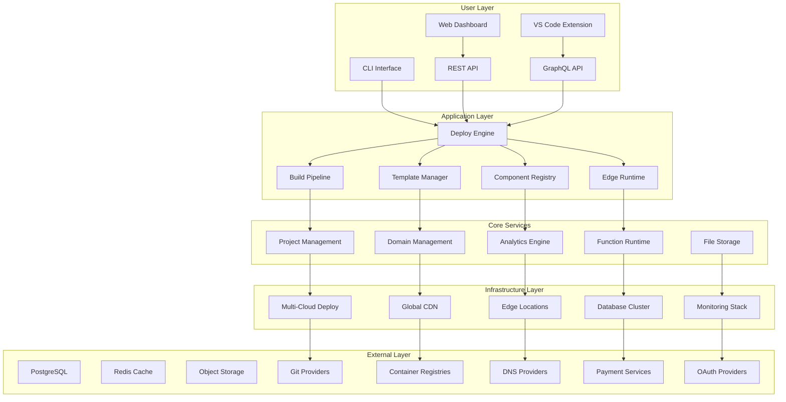
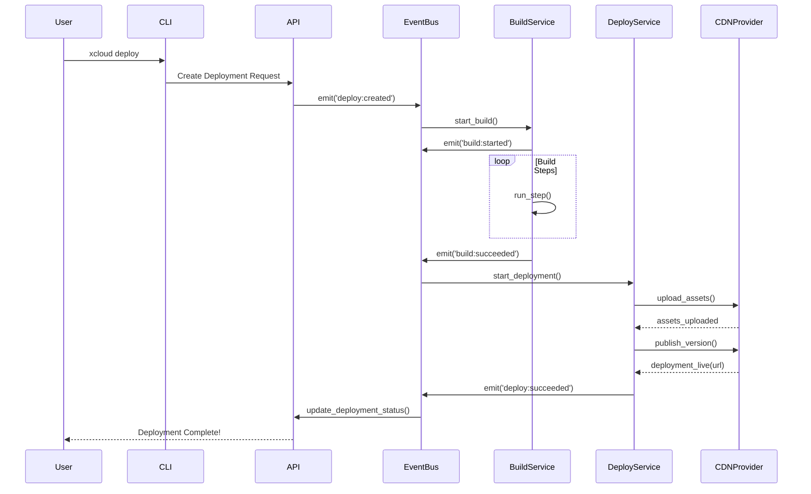
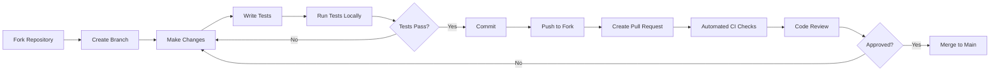

# Documentação da Arquitetura da Plataforma xCloud

## 📚 Table of Contents

1. [System Architecture](#system-architecture)
2. [Platform Structure](#platform-structure)
3. [Core Components](#core-components)
4. [Serverless Runtime](#serverless-runtime)
5. [Edge Computing](#edge-computing)
6. [Build & Deploy Pipeline](#build--deploy-pipeline)
7. [Template System](#template-system)
8. [Component Marketplace](#component-marketplace)
9. [Security Architecture](#security-architecture)
10. [Deployment Architecture](#deployment-architecture)
11. [Development Workflow](#development-workflow)

## 🏗️ System Architecture

### High-Level Overview



## 📁 Platform Structure

### Core Platform Structure

```tree
xcloud/                                      # Main package
│
├── 📦 xcloud/
│   ├── __init__.py                        # Package initialization
│   ├── __version__.py                     # Version management
│   │
│   ├── 🎮 cli/                           # CLI Interface
│   │   ├── __init__.py
│   │   ├── main.py                       # Entry point
│   │   ├── commands/
│   │   │   ├── init.py                   # Project creation
│   │   │   ├── dev.py                    # Local development server
│   │   │   ├── build.py                  # Build tools
│   │   │   ├── deploy.py                 # Deployment tools
│   │   │   ├── domains.py                # Domain management
│   │   │   └── env.py                    # Environment variables
│   │   └── utils/
│   │       ├── prompts.py                # Interactive prompts
│   │       └── validators.py             # Input validation
│   │
│   ├── 🤖 core/                          # Core Platform Components
│   │   ├── __init__.py
│   │   ├── build.py                      # Build controller
│   │   ├── deploy.py                     # Deployment controller
│   │   ├── runtime.py                    # Serverless runtime
│   │   ├── events.py                     # Event system
│   │   ├── exceptions.py                 # Custom exceptions
│   │   ├── interfaces/
│   │   │   ├── framework.py              # Framework interface
│   │   │   ├── storage.py                # Storage interface
│   │   │   └── vcs.py                    # Version control interface
│   │   └── models/
│   │       ├── project.py                # Project model
│   │       ├── deployment.py             # Deployment model
│   │       ├── build.py                  # Build model
│   │       └── user.py                   # User model
│   │
│   ├── 🔌 plugins/                       # Built-in Plugins
│   │   ├── __init__.py
│   │   ├── frameworks/
│   │   │   ├── __init__.py
│   │   │   ├── base.py                   # Base framework
│   │   │   ├── nextjs.py                 # Next.js plugin
│   │   │   ├── fastapi.py                # FastAPI plugin
│   │   │   └── static.py                 # Static site plugin
│   │   ├── providers/
│   │   │   ├── __init__.py
│   │   │   ├── aws.py                    # AWS provider
│   │   │   ├── gcp.py                    # GCP provider
│   │   │   └── vercel.py                 # Vercel provider
│   │   └── notifications/
│   │       ├── __init__.py
│   │       ├── email.py
│   │       ├── discord.py
│   │       └── webhook.py
│   │
│   ├── 📦 packages/                      # Package Management for Components
│   │   ├── __init__.py
│   │   ├── manager.py                    # Package manager
│   │   ├── registry.py                   # Registry client
│   │   └── loader.py                     # Dynamic loader
│   │
│   ├── 🎯 engine/                        # Orchestration Engine
│   │   ├── __init__.py
│   │   ├── build_queue.py                # Build job queue
│   │   ├── scheduler.py                  # Task scheduler
│   │   ├── asset_optimizer.py            # Asset optimization
│   │   └── analytics.py                  # Analytics processing
│   │
│   ├── 🌐 server/                        # Web Server (Dashboard API)
│   │   ├── __init__.py
│   │   ├── app.py                        # FastAPI app
│   │   ├── api/
│   │   │   ├── __init__.py
│   │   │   ├── routes.py                 # API routes
│   │   │   ├── websocket.py              # WebSocket server
│   │   │   └── auth.py                   # Authentication
│   │   └── dashboard/                    # Web dashboard frontend
│   │       ├── src/
│   │       └── dist/
│   │
│   ├── 💾 database/                      # Database
│   │   ├── __init__.py
│   │   ├── models.py                     # SQLAlchemy models
│   │   ├── migrations/                   # Alembic migrations
│   │   └── cache.py                      # Redis cache
│   │
│   └── 🛠️ utils/                        # Utilities
│       ├── __init__.py
│       ├── logger.py                     # Logging setup
│       ├── config.py                     # Configuration
│       └── helpers.py                    # Helper functions
│
├── 📚 docs/                              # Documentation
├── 🧪 tests/                             # Tests
├── 📦 examples/                          # Example projects
├── 🐳 containers/                        # Container files
├── .github/                              # GitHub config
├── LICENSE
└── README.md
```

### User Project Structure (Created by `xcloud init`)

```tree
my-nextjs-app/                          # User's project
│
├── 📋 xcloud.json                        # Project configuration
├── .env.local                            # Environment variables
├── .gitignore
│
├── pages/                                # Next.js pages
│   ├── _app.js
│   └── index.js
├── public/                               # Static assets
├── styles/                               # CSS files
├── package.json                          # Node.js dependencies
└── README.md                             # Project documentation
```

## 🔧 Core Components

### 1. Build Pipeline

```python
# xcloud/core/build.py
from abc import ABC, abstractmethod

class BuildPipeline:
    """Orchestrates the build process for a project."""
    
    def __init__(self, project_context):
        self.context = project_context
        self.steps = []

    def add_step(self, step: 'BuildStep'):
        self.steps.append(step)

    async def execute(self):
        """Run all build steps in sequence."""
        build_output = {}
        for step in self.steps:
            result = await step.run(self.context, build_output)
            build_output.update(result)
        return build_output

class BuildStep(ABC):
    @abstractmethod
    async def run(self, context, previous_output):
        """Execute a single step of the build."""
        pass
```

### 2. Deployment Engine

```python
# xcloud/core/deploy.py
class DeployEngine:
    """Handles the deployment of build artifacts to infrastructure."""
    
    def __init__(self, provider_plugin):
        self.provider = provider_plugin

    async def deploy(self, build_artifacts):
        """Deploys artifacts using the configured provider."""
        deployment_id = self._generate_id()
        await self.provider.upload(build_artifacts)
        url = await self.provider.publish(deployment_id)
        return {"url": url, "id": deployment_id}
```

### 3. Event System

```python
# xcloud/core/events.py
from typing import Callable, Dict, List, Any
import asyncio

class EventBus:
    """Central event management system for the platform."""
    
    def __init__(self):
        self._handlers: Dict[str, List[Callable]] = {}
        
    def on(self, event: str, handler: Callable):
        """Register an event handler."""
        self._handlers.setdefault(event, []).append(handler)
    
    async def emit(self, event: str, *args, **kwargs):
        """Emit an event to all registered handlers."""
        tasks = [
            handler(*args, **kwargs) 
            for handler in self._handlers.get(event, [])
        ]
        if tasks:
            await asyncio.gather(*tasks)
```

## 🔄 Deployment Event Flow

### Event Flow Diagram



### Common Event Types

```python
# xcloud/core/events.py
class Events:
    # Deployment events
    DEPLOY_CREATED = "deploy:created"
    DEPLOY_SUCCEEDED = "deploy:succeeded"
    DEPLOY_FAILED = "deploy:failed"
    
    # Build events
    BUILD_STARTED = "build:started"
    BUILD_SUCCEEDED = "build:succeeded"
    BUILD_FAILED = "build:failed"
    
    # Domain events
    DOMAIN_MAPPED = "domain:mapped"
    DOMAIN_UNMAPPED = "domain:unmapped"
    
    # Project events
    PROJECT_CREATED = "project:created"
    PROJECT_DELETED = "project:deleted"
```

## 🔐 Security Architecture

### Security Layers

```yaml
Application Security:
  - Input validation on all API endpoints
  - SQL injection prevention (ORM)
  - XSS protection on dashboard
  - CSRF tokens for web forms
  - Rate limiting on authentication and sensitive APIs

API Security:
  - JWT for user authentication
  - Scoped API key management for programmatic access
  - OAuth 2.0 support for third-party integrations
  - IP whitelisting for sensitive operations

Data Security:
  - Encryption at rest (AES-256) for user data and build artifacts
  - Encryption in transit (TLS 1.3) for all communications
  - Regular key rotation for internal services
  - Secure credential storage using HashiCorp Vault or similar
  - Environment variable management via secure API

Build & Runtime Security:
  - Sandboxed build environments (containers)
  - Resource limits on builds and functions
  - Permission system for project access
  - Dependency scanning (Snyk/Dependabot)
```

## 🚀 Deployment Architecture

### Production Deployment

```yaml
Infrastructure:
  Load Balancer:
    - NGINX / AWS ELB
    - SSL termination
    - Rate limiting
    
  Application Servers (API & Dashboard):
    - Multiple instances in an Auto-Scaling Group
    - Health checks
    
  Background Workers (Builds, etc.):
    - Celery with Redis/RabbitMQ
    - Separate auto-scaling group for workers
    
  Databases:
    - PostgreSQL (primary, managed service like RDS)
    - Redis (cache & queue, managed service like ElastiCache)
    
  Storage:
    - S3 / Google Cloud Storage for build artifacts and logs
    
  Monitoring:
    - Prometheus for metrics
    - Grafana for dashboards
    - Sentry for error tracking
    - ELK Stack for logging
```

### Podman Deployment for Development

```containerfile
# Podmanfile
FROM python:3.9-slim

WORKDIR /app

# Install dependencies
COPY requirements.txt .
RUN pip install --no-cache-dir -r requirements.txt

# Copy application
COPY . .

# Install xcloud in editable mode
RUN pip install -e .

# Run the API server
CMD ["uvicorn", "xcloud.server.app:app", "--host", "0.0.0.0", "--port", "8000"]
```

## 💻 Development Workflow

### Contributing Workflow



### Testing Strategy

```python
# tests/test_build.py
import pytest
from xcloud.core.build import BuildPipeline
from xcloud.plugins.frameworks import nextjs

async def test_nextjs_build_pipeline():
    # Arrange
    project_context = {"framework": "nextjs", "source_dir": "/path/to/project"}
    pipeline = BuildPipeline(project_context)
    pipeline.add_step(nextjs.InstallDependenciesStep())
    pipeline.add_step(nextjs.RunBuildStep())
    
    # Act
    build_artifacts = await pipeline.execute()
    
    # Assert
    assert "output_dir" in build_artifacts
    assert build_artifacts["output_dir"] == "/path/to/project/.next"
```

---

<div align="center">

**xCloud Platform** - The Future of Web Deployment

[Documentation](https://docs.xcloud.io) | [GitHub](https://github.com/PageCloudv1/xcloud-platform) | [Discord](https://discord.gg/xcloud)

</div>